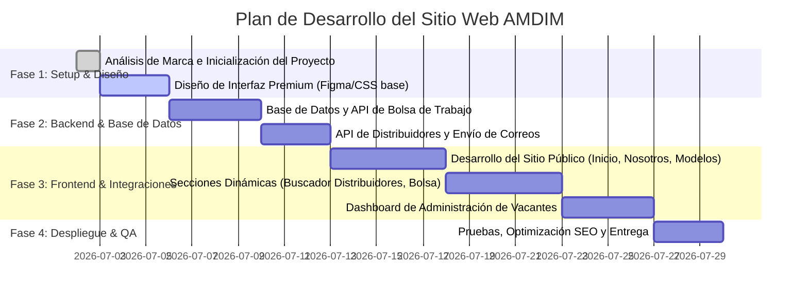

# Análisis de Requerimientos - Sitio Web AMDIM

Este documento presenta el análisis técnico y de diseño para el desarrollo del nuevo sitio web de la **Asociación Mexicana de Distribuidores Mitsubishi, A.C. (AMDIM)**, basado en la documentación y los assets proporcionados.

---

## 1. Resumen de Requerimientos por Sección

El sitio web constará de una estructura limpia y moderna orientada a dar soporte a la red de distribuidores de Mitsubishi en México. A continuación, se detalla el desglose por sección según el documento de referencia:

### A. Barra de Navegación (Header)
*   **Secciones principales:**
    1.  `Inicio`
    2.  `Quiénes somos`
    3.  `Modelos`
    4.  `Distribuidores`
    5.  `Bolsa de Trabajo`
    6.  `Noticias`
    7.  `Contacto`

### B. Inicio (Home)
*   **Elemento Principal:** Hero Video (Video de portada de alto impacto visual).
*   **Contenido Breve:** Texto descriptivo sobre AMDIM.
*   **Ubicación y Contacto:**
    *   Dirección física: *Juan Vázquez de Mella 481, Piso 2-203, Los Morales Polanco, Miguel Hidalgo, Ciudad de México, C.P. 11510*.
    *   Mapa de ubicación interactivo (Google Maps).
    *   Teléfonos de contacto:
        *   AMDIM: `55 5255 3904`
        *   SP AMDIM: `55 5545 4381`
*   **Redes Sociales:** Link directo al perfil de LinkedIn oficial (*Asociación Mexicana Distribuidores Mitsubishi, A.C.*).

### C. Quiénes Somos (Nosotros)
*   **Historia:** Explicación del inicio de operaciones en abril de 2004 y su representación de los 71 Distribuidores Autorizados en México.
*   **Misión y Visión:** Declaraciones institucionales enfocadas en promover, defender y fortalecer a la red de distribuidores.
*   **Estructura Organizacional:** Organigrama o tarjetas de perfil de los miembros clave:
    *   **Francisco Vargas Montoya** (Director) - `fvm@amdim.com.mx`
    *   **Barbara Ibarguen Troncoso** (Gerente de Marketing) - `bit@amdim.com.mx`
    *   **Daniela Sánchez Pineda** (Coordinadora de Paid Media & CRM) - `dsp@amdim.com.mx`
    *   **José Cipriano Volantín Carranco** (Coordinador de Estudios Económicos) - `jcv@amdim.com.mx`
    *   **Jazmín Martínez Gúzman** (Auxiliar Contable) - `jmg@amdim.com.mx`

### D. Modelos
*   **Contenido:** Listado de modelos de vehículos Mitsubishi actualmente vigentes (se han identificado assets visuales listos para vehículos en `/assets/images/vehicles/` como L200, Outlander, Xpander, Mirage, Montero, etc.).
*   **Interactividad:** Opción para descargar la ficha técnica (PDF) de cada modelo.

### E. Distribuidores (Geolocalización)
*   **Mapa Interactivo:** Buscador y localizador geográfico de distribuidores (Referencia visual: sección `AMDK-2026`).
*   **Directorio de Distribuidores:** Listado completo que incluye:
    *   Foto del distribuidor.
    *   Nombre comercial.
    *   Teléfono.
    *   Redirección a su sitio web oficial.
    *   Dirección física.
    *   Enlace/botón con la opción "Cómo llegar" (integración con Google Maps/Waze).
*   **Portal Administrativo:** Módulo interno para la carga y actualización de Distribuidores & Fichas.

### F. Bolsa de Trabajo
*   **Portal del Distribuidor (Dashboard):** Los distribuidores asociados podrán iniciar sesión para dar de alta vacantes especificando:
    *   Correo de quien recibirá los CVs.
    *   Título de la vacante.
    *   Descripción del puesto (con límite de caracteres).
    *   Vigencia de la vacante (desactivación automática en 1 mes o de forma manual).
*   **Vista del Candidato (Público):** Los usuarios podrán ver las vacantes disponibles y aplicar a ellas ingresando:
    *   Título de la vacante (preseleccionada).
    *   Descripción detallada.
    *   Carga de archivo de CV (PDF/Word).
    *   Botón de acción "Aplicar" (envía la información directamente al correo del distribuidor especificado en la vacante).

### G. Noticias
*   **Integración:** Feed dinámico de LinkedIn que refleja en tiempo real las publicaciones realizadas en la cuenta institucional de AMDIM.

### H. Contacto
*   **Formulario:** Captura de datos básicos:
    *   Nombre y Apellidos.
    *   Correo Electrónico.
    *   Teléfono.
    *   Comentarios/Mensaje.
*   **Destinatario:** Envío automático de notificaciones por correo a: `buzonamdim@amdim.com.mx`.

---

## 2. Propuesta de Arquitectura Técnica

Para cumplir con los requerimientos de manera escalable y profesional, propongo el siguiente stack full-stack:

```mermaid
graph TD
    subgraph Frontend (Cliente)
        A[Single Page Application / Vite + React o Vanilla JS] --> B[Diseño UI Premium]
        B --> B1[Tipografía Corporativa MMCOFFICE]
        B --> B2[Alineación con Manual de Marca Mitsubishi]
        B --> B3[Componentes dinámicos e interactivos]
    end

    subgraph Backend (Servidor API)
        C[Servidor Node.js con Express] --> D[Rutas de API REST]
        D --> D1[API de Distribuidores / Geolocalización]
        D --> D2[API de Bolsa de Trabajo]
        D --> D3[Mapeador de Contacto / Envío de Correos Nodemailer]
    end

    subgraph Base de Datos & Almacenamiento
        E[(Base de Datos - SQLite / PostgreSQL)] --> C
        F[Almacenamiento de Fichas & CVs - Local / AWS S3] --> C
    end
    
    A <-->|Peticiones HTTP/JSON| C
```

### Componentes de Software Clave:
1.  **Frontend:**
    *   Estilos estilizados con **Vanilla CSS** moderno utilizando variables personalizadas para la paleta de colores de Mitsubishi (Rojo, Negro, Gris, Blanco) según su manual de marca.
    *   Uso de los archivos TTF de tipografía provistos: `MMCOFFICE-Regular`, `MMCOFFICE-Medium`, `MMCOFFICE-Bold`.
    *   Integración de Google Maps API para la geolocalización de distribuidores.
2.  **Backend (Node.js & Express):**
    *   Endpoints para CRUD de distribuidores y vacantes de empleo.
    *   Autenticación de distribuidores para acceder al Dashboard (JWT).
    *   Integración con SMTP (Nodemailer) para despachar correos del formulario de contacto y postulaciones de empleo.
3.  **Base de Datos (Relacional):**
    *   Tablas para: `Usuarios (Distribuidores)`, `Distribuidores (Sucursales)`, `Vacantes (Bolsa de trabajo)`.

---

## 3. Puntos de Confirmación y Dudas Clave

> [!IMPORTANT]
> Para proceder con la implementación exacta, necesitamos validar los siguientes puntos con el cliente:

1.  **Dashboard de Distribuidores:**
    *   *¿Cómo se darán de alta las cuentas de los distribuidores para acceder al dashboard?* ¿Se creará una cuenta de administrador central que genere los accesos, o habrá un registro abierto sujeto a aprobación?
2.  **Campos del Formulario de Contacto:**
    *   El documento menciona: *"Confirmar que campos debe contener esta sección para que nos lleguen sus comentarios"*. Los campos propuestos en el PDF son: **Mail, Nombre, Apellido, Teléfono, Comentarios**. *¿Son suficientes estos campos o se requiere alguno adicional (ej. Distribuidor de interés, Ciudad, etc.)?*
3.  **Feed de Noticias (LinkedIn):**
    *   *¿Se cuenta con las credenciales de la API de LinkedIn para integrar un widget nativo, o se prefiere utilizar una herramienta de embebido de terceros (como Juicer, ElfSight, o similar) para mostrar el feed en tiempo real?*
4.  **Hojas de Estilo y Colores (Manual de Marca):**
    *   El manual de marca está presente como `BrandManual_05_v9.1_English.pdf.pdf`. Lo utilizaremos para extraer los códigos de color exactos (#E2001A para el rojo Mitsubishi, etc.) y las pautas visuales de layout.

---

## 4. Plan de Acción Inmediato



---
*Preparado por Antigravity (Desarrollador Full Stack)*
